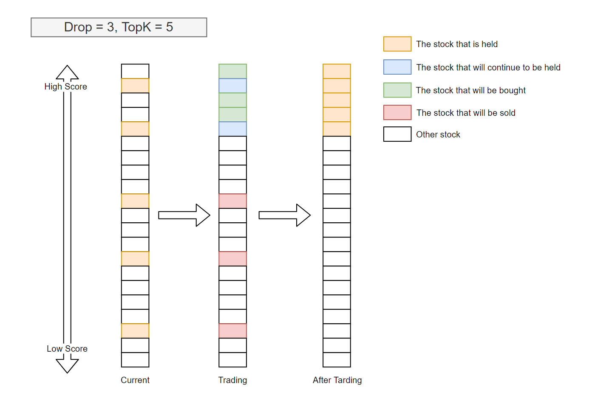

# SimonsHFT: Nested Decision Execution Framework for High-Frequency Trading

## Overview

The `SimonsHFT` is a nested decision execution workflow designed to support high-frequency trading (HFT) by integrating multiple levels of trading strategies. This framework allows for joint backtesting of daily and intraday trading strategies, considering their interactions to optimize overall performance.

## Table of Contents

- [Overview](#overview)
- [Introduction](#introduction)
- [Framework Design](#framework-design)
- [Getting Started](#getting-started)
  - [Installation](#installation)
  - [Data Preparation](#data-preparation)
- [Running the Workflow](#running-the-workflow)
  - [Information Extractor](#information-extractor)
  - [Training the Model](#training-the-model-tbd)
    - [Run example model](#run-example-model)
  - [Decision Generator](#decision-generator)
  - [Backtesting](#backtesting)
    - [Weekly Portfolio Generation and Daily Order Execution](#weekly-portfolio-generation-and-daily-order-execution)
    - [Daily Portfolio Generation and Minutely Order Execution](#daily-portfolio-generation-and-minutely-order-execution)


## Introduction

Daily trading (e.g., portfolio management) and intraday trading (e.g., order execution) are typically studied separately in quantitative investment. To achieve joint trading performance, these strategies must interact and be backtested together. The `NestedDecisionExecutionWorkflow` framework provided by `Qlib` supports multi-level joint backtesting strategies, allowing for accurate evaluation and optimization. Our `SimonsHFT` framework is built on top of this framework to support high-frequency trading operations.

## Framework Design

The `SimonsHFT` considers the interaction of strategies at multiple levels. Each level consists of a "Trading Agent" and "Execution Environment." The "Trading Agent" includes:
- Data processing module ("Information Extractor")
- Forecasting module ("Forecast Model")
- Decision generator ("Decision Generator")

The trading algorithm generates decisions based on forecast signals, which are then executed by the "Execution Environment", and returns the execution results.

## Getting Started

### Installation

1. Clone the repository:

    ```bash
    git clone https://github.com/Flemington7/SimonsAgent.git
    cd SimonsHFT
    ```

2. Install the required Python packages:

    ```bash
    pip install -r requirements.txt
    ```

### Data Preparation

- **Financial Data**: Download and prepare the financial data as required by Qlib. If you want to use the default data, you can download the data from the [Qlib documentation](https://qlib.readthedocs.io/en/latest/start/initialization.html). If you want to use custom data, you can follow the [data collector](data_collector/README.md) for setting up data. As mentioned before, we will integrate the sentiment data with the financial data, and convert it into a format that suitable for backtesting. 

## Running the Workflow


### Information Extractor

As mentioned above, the `SimonsHFT` framework integrates advanced sentiment analysis using FinLLAMA. By incorporating real-time sentiment data from news and social media, we aim to enhance the decision-making process and profitability in volatile stock markets. We plan to use the FinLLAMA model to extract and analyze financial sentiments from news and social media and convert these textual data into numerical data for further analysis.

### Training the Model (TBD)

An increasing number of SOTA Quant research works/papers, which focus on building forecasting models to mine valuable signals/patterns in complex financial data, are released in `Qlib`. All these models are runnable with Qlib. Users can find the config files they provide and some details about the model through the [benchmarks](examples/benchmarks) folder. More information can be retrieved at the qlib [documentation](https://qlib.readthedocs.io/en/latest/start/integration.html).

#### Run example model

`Qlib` provides three different ways to run a single model, users can pick the one that fits their cases best:

- Users can use the tool `qrun` mentioned above to run a model's workflow based from a config file.

- Users can create a `workflow_by_code` python script based on the [one](examples/workflow_by_code.py) listed in the `examples` folder.

- Users can use the script [`run_all_model.py`](examples/run_all_model.py) listed in the `examples` folder to run a model. Here is an example of the specific shell command to be used: `python run_all_model.py run --models=lightgbm`, where the `--models` arguments can take any number of models listed above(the available models can be found  in [benchmarks](examples/benchmarks/)). For more use cases, please refer to the file's [docstrings](examples/run_all_model.py).
    - **NOTE**: Each baseline has different environment dependencies, please make sure that your python version aligns with the requirements(e.g. TFT only supports Python 3.6~3.7 due to the limitation of `tensorflow==1.15.0`)

`Qlib` also provides a script [`run_all_model.py`](examples/run_all_model.py) which can run multiple models for several iterations.
 
- **NOTE**: the script only support *Linux* for now. Other OS will be supported in the future. Besides, it doesn't support parallel running the same model for multiple times as well.

The script will create a unique virtual environment for each model, and delete the environments after training. Thus, only experiment results such as `IC` and `backtest` results will be generated and stored.

Here is an example of running all the models for 10 iterations:

```python
python run_all_model.py run 10
```

It also provides the API to run specific models at once. For more use cases, please refer to the file's [docstrings](examples/run_all_model.py). 

### Decision Generator

Besides backtesting, the optimization of strategies from different levels is not standalone and can be affected by each other. For example, the best portfolio management strategy may change with the performance of order executions (e.g. a portfolio with higher turnover may become a better choice when we improve the order execution strategies). To achieve overall good performance, it is necessary to consider the interaction of strategies at a different levels.

Therefore, building a new framework for trading on multiple levels becomes necessary to solve the various problems mentioned above, for which we designed a nested decision execution framework that considers the interaction of strategies.

#### Base Strategy

Qlib provides a base class qlib.strategy.base.BaseStrategy. All strategy classes need to inherit the base class and implement its interface. Users can inherit BaseStrategy to customize their strategy class.

- generate_trade_decision

    generate_trade_decision is a key interface that generates trade decisions in each trading bar. The frequency to call this method depends on the executor frequency(“time_per_step”=”day” by default). But the trading frequency can be decided by users’ implementation. For example, if the user wants to trading in weekly while the time_per_step is “day” in executor, user can return non-empty TradeDecision weekly(otherwise return empty like [this](https://github.com/microsoft/qlib/blob/main/qlib/contrib/strategy/signal_strategy.py#L138) ).

After users specifying the models(forecasting signals) and strategies, running backtest will help users to check the performance of a custom model(forecasting signals)/strategy.

#### Implemented Strategy

Qlib provides several implemented portfolio strategies.
- portfolio/signal strategy: `TopkDropoutStrategy`, `WeightStrategyBase`, `EnhancedIndexingStrategy`. Portfolio strategy is designed to adopt different portfolio strategies, which means that users can adopt different algorithms to generate investment portfolios based on the prediction scores of the forecasting model.

- order execution/rule strategy: `TWAPStrategy` (Time Weighted Average Price Strategy), `SBBStrategyBase` (Select the Better Bar Strategy), `SBBStrategyEMA` (Select the Better Bar Strategy with Exponential Moving Average Signal), which are using for the order execution, so it have no association with the forecasting signals.

##### TopkDropoutStrategy

In `examples/benchmarks` we have various **alpha** models that predict the stock returns. We also use a simple rule based `TopkDropoutStrategy` to evaluate the investing performance of these models. TopkDropoutStrategy is a subclass of BaseStrategy and implement the interface generate_order_list whose process is as follows.

- Adopt the Topk-Drop algorithm to calculate the target amount of each stock.
    There are two parameters for the Topk-Drop algorithm:

    - Topk: The number of stocks held
    
    - Drop: The number of stocks sold on each trading day
    
    In general, the number of stocks currently held is Topk, with the exception of being zero at the beginning period of trading. For each trading day, let $d$ be the number of the instruments currently held and with a rank $K$ when ranked by the prediction scores from high to low. Then $d$ number of stocks currently held with the worst prediction score will be sold, and the same number of unheld stocks with the best prediction score will be bought.
    
    In general, $d=$`Drop`, especially when the pool of the candidate instruments is large, $K$ is large, and Drop is small.
    
    In most cases, TopkDrop algorithm sells and buys Drop stocks every trading day, which yields a turnover rate of $2*$`Drop`/$K$.
    
    The following images illustrate a typical scenario.
    
- Generate the order list from the target amount

### Backtesting

This [workflow](workflow.py) is an example for nested decision execution in backtesting. Qlib supports nested decision execution in backtesting. It means that users can use different strategies to make trade decision in different frequencies.

#### Daily Portfolio Generation and Minutely Order Execution

This [workflow](workflow.py) provides an example that uses a DropoutTopkStrategy (a strategy based on the daily frequency Lightgbm model) in weekly frequency for portfolio generation and uses `SBBStrategyEMA` (a rule-based strategy that uses EMA for decision-making) to execute orders in minutely frequency, besides, we also use the `TWAPStrategy` (Time Weighted Average Price Strategy for order execution) to execute orders in 5 minutely frequency.

Start backtesting by running the following command:

```bash
python workflow.py backtest
```

After running the [workflow](workflow.py), you will see the following output like this (at this time, we run the weekly portfolio generation and minutely order execution):

```bash
[21830:MainThread](2024-05-30 21:35:06,100) INFO - qlib.workflow - [record_temp.py:515] - Portfolio analysis record 'port_analysis_1day.pkl' has been saved as the artifact of the Experiment 1
'The following are analysis results of benchmark return(1day).'
                       risk
mean              -0.000225
std                0.001969
annualized_return -0.053616
information_ratio -1.764751
max_drawdown      -0.027478
'The following are analysis results of the excess return without cost(1day).'
                       risk
mean               0.001371
std                0.015283
annualized_return  0.326362
information_ratio  1.384220
max_drawdown      -0.213554
'The following are analysis results of the excess return with cost(1day).'
                       risk
mean               0.001363
std                0.015282
annualized_return  0.324297
information_ratio  1.375560
max_drawdown      -0.213554
[21830:MainThread](2024-05-30 21:35:06,123) INFO - qlib.workflow - [record_temp.py:540] - Indicator analysis record 'indicator_analysis_1day.pkl' has been saved as the artifact of the Experiment 1
'The following are analysis results of indicators(1day).'
        value
ffr  0.960916
pa   0.000476
pos  0.562500
[21830:MainThread](2024-05-30 21:35:06,708) INFO - qlib.timer - [log.py:127] - Time cost: 0.000s | waiting `async_log` Done
```
