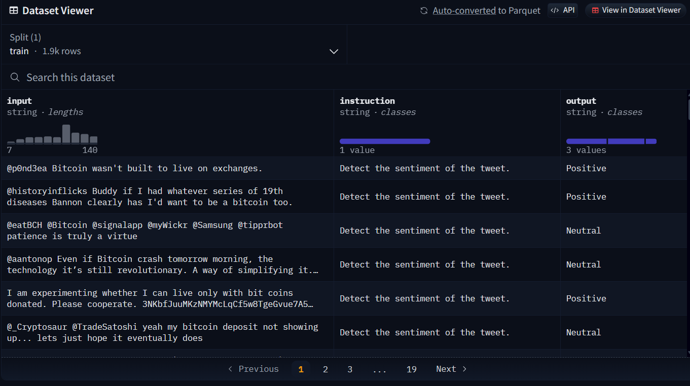

### llama3 sentiment analysis
the following is a list of resources that can be used to fine-tune the llama3 model for sentiment analysis or event analysis in the cryptocurrency market.:
* a kaggle notebook that fine-tunes the llama3 model for sentiment analysis on the financial dataset: [link](https://www.kaggle.com/username/llama3-sentiment-analysis) (strongly recommended, it has a detailed explanation of the code and the dataset used in the fine-tuning process.)
* huggingface datasets that can be used to fine-tune the llama3 model for sentiment analysis on the cryptocurrency dataset: [link](https://huggingface.co/datasets?search=bitcoin)

* kaggle datasets and notebooks that can be used to fine-tune the llama3 model for sentiment analysis on the cryptocurrency dataset [link](https://www.kaggle.com/search?q=bitcoin+sentiment)
https://www.kaggle.com/datasets/kaushiksuresh147/bitcoin-tweets

### data preprocessing in EarnHFT
There are three steps to preprocess the downloaded data to usable data which can be used in training EarnHFT.

1. Concatenation and Cleanining: In this paper, they download the [5-level orderbook snapshot](https://docs.tardis.dev/downloadable-csv-files#book_snapshot_5) and [trades](https://docs.tardis.dev/downloadable-csv-files#tradeshttps://docs.tardis.dev/downloadable-csv-files#trades) in [Tardis](https://docs.tardis.dev/). The data is then concatenated and cleaned to remove any missing values. 
However, we cannot afford the fees to download the data from Tardis, so we will use the [Binance Public Data](https://github.com/binance/binance-public-data/#aggtrades) to reconstruct the data in the same format as the Tardis data(We can click dataset preview button in the 5-level orderbook snapshot and trades link to preview the format). 
Since many of the columns in the Tardis raw data will be clean, so we will only need to match the columns in the Binance Public Data to the cleaned columns format in the [concat_clean.py file](https://github.com/qinmoelei/EarnHFT/blob/main/data_preprocess/preprocess/concat_clean.py).

2. Creating Features

3. Merging Features: This step will create a df.feather which will be used in the training of EarnHFT.
for detailed information on the data preprocessing steps, refer to the [Data Preparation for EarnHFT](https://github.com/qinmoelei/EarnHFT/tree/main/data_preprocess)
